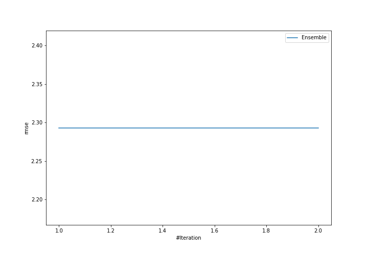
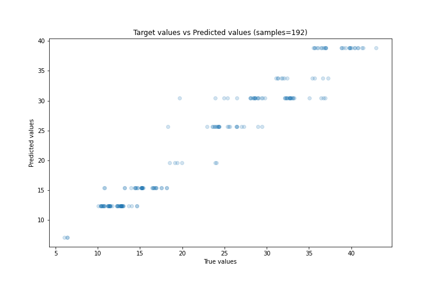
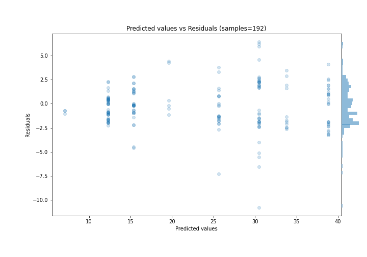

# Summary of Ensemble

[<< Go back](../README.md)

## Ensemble structure
| Model          |   Weight |
|:---------------|---------:|
| 2_DecisionTree |        1 |

### Metric details:
| Metric   |     Score |
|:---------|----------:|
| MAE      | 1.75107   |
| MSE      | 5.25803   |
| RMSE     | 2.29304   |
| R2       | 0.949345  |
| MAPE     | 0.0821566 |

## Learning curves

## True vs Predicted

## Predicted vs Residuals

[<< Go back](../README.md)
