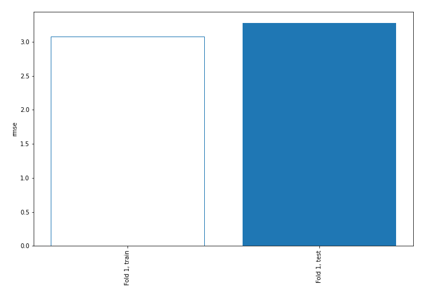
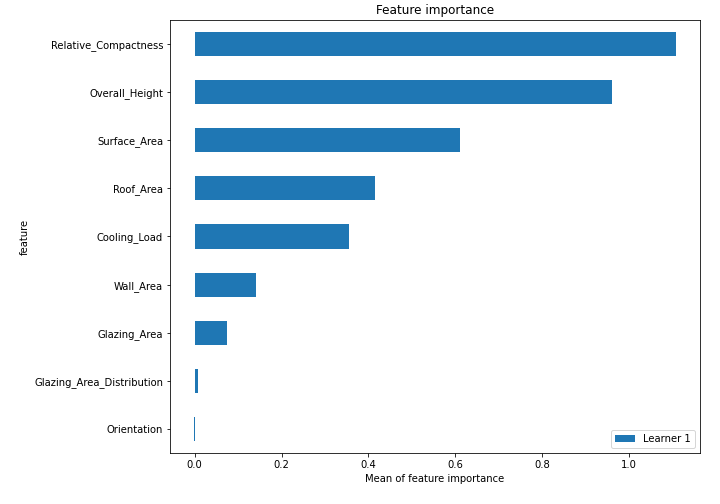
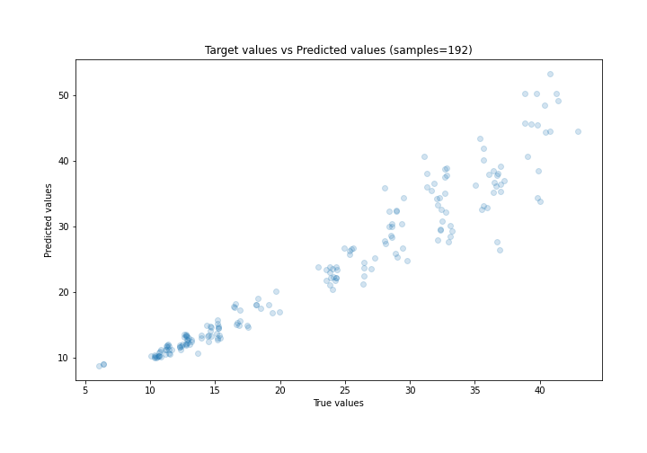
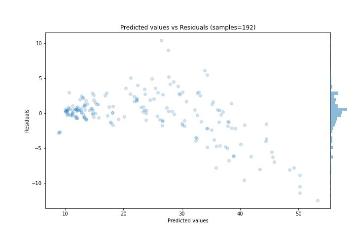
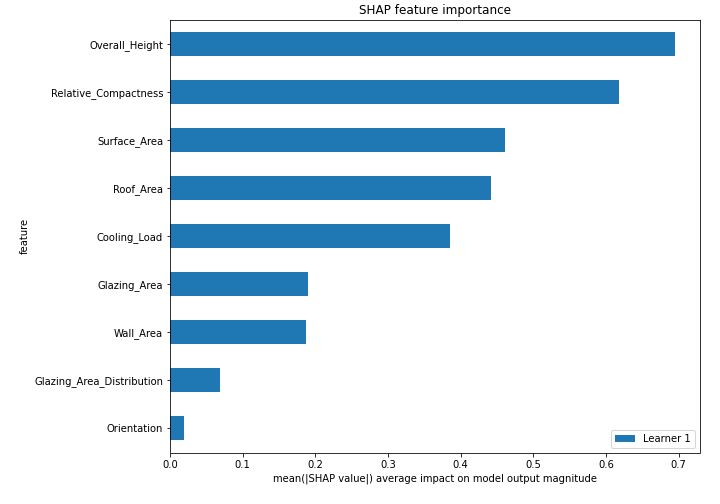
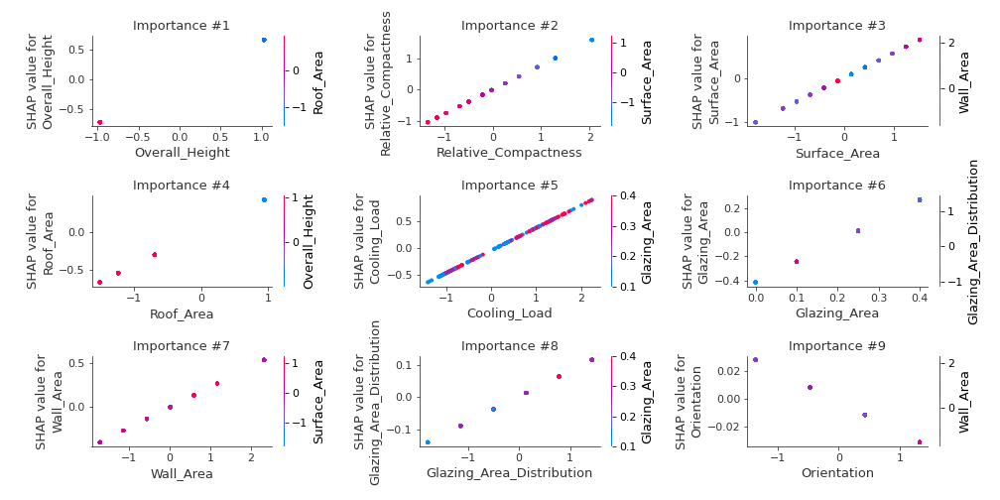
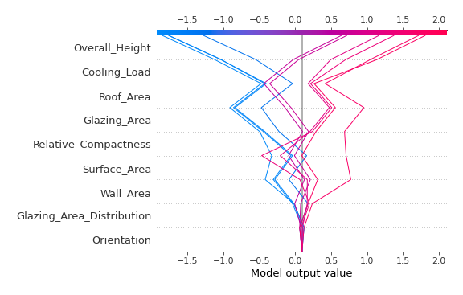
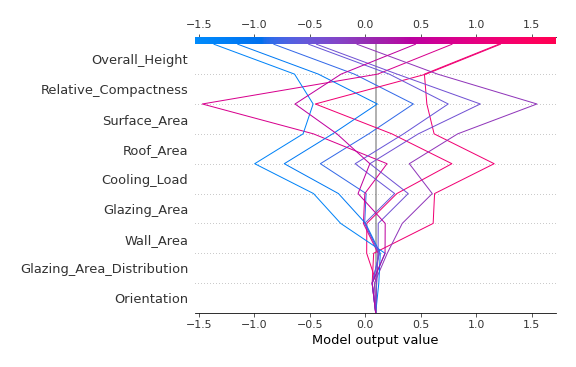

# Summary of 3_Linear

[<< Go back](../README.md)

## Linear Regression (Linear)
- **n_jobs**: -1
- **explain_level**: 2

## Validation
 - **validation_type**: split
 - **train_ratio**: 0.75
 - **shuffle**: True

## Optimized metric
rmse

## Training time

1.6 seconds

### Metric details:
| Metric   |      Score |
|:---------|-----------:|
| MAE      |  2.19484   |
| MSE      | 10.7328    |
| RMSE     |  3.27609   |
| R2       |  0.896602  |
| MAPE     |  0.0861955 |

## Learning curves

## Coefficients
| feature                   |   Learner_1 |
|:--------------------------|------------:|
| Glazing_Area              |   1.71594   |
| Relative_Compactness      |   0.773571  |
| Overall_Height            |   0.697083  |
| Surface_Area              |   0.565035  |
| Roof_Area                 |   0.448041  |
| Cooling_Load              |   0.424676  |
| Wall_Area                 |   0.232472  |
| Glazing_Area_Distribution |   0.0798822 |
| Orientation               |  -0.0223126 |
| intercept                 |  -0.404854  |

## Permutation-based Importance

## True vs Predicted

## Predicted vs Residuals

## SHAP Importance

## SHAP Dependence plots

### Dependence (Fold 1)

## SHAP Decision plots

### Top-10 Worst decisions (Fold 1)

### Top-10 Best decisions (Fold 1)

[<< Go back](../README.md)
