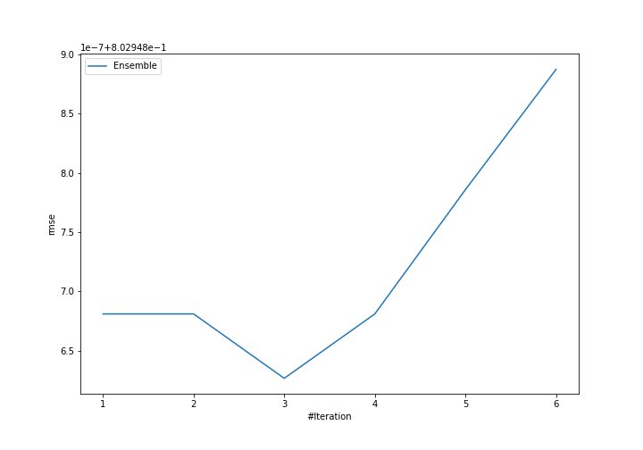
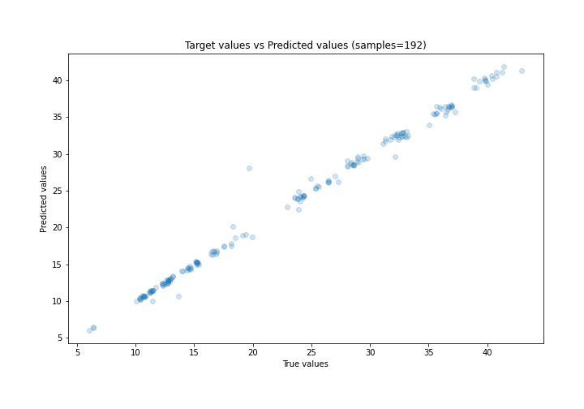
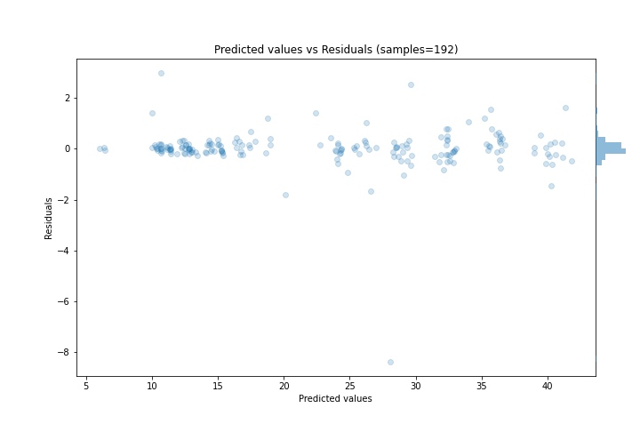

# Summary of Ensemble

[<< Go back](../README.md)

## Ensemble structure
| Model             |   Weight |
|:------------------|---------:|
| 4_Default_Xgboost |        3 |

### Metric details:
| Metric   |     Score |
|:---------|----------:|
| MAE      | 0.356636  |
| MSE      | 0.644726  |
| RMSE     | 0.802949  |
| R2       | 0.993789  |
| MAPE     | 0.0159429 |

## Learning curves

## True vs Predicted

## Predicted vs Residuals

[<< Go back](../README.md)
